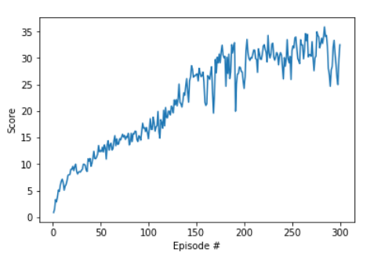
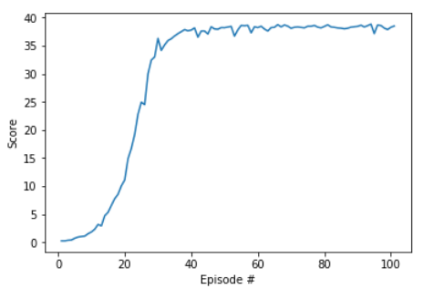

# report

## Environment

The Reacher Environment with 20 agents. It has a continuous action space [-1,1] and 33 state size. It is a double jointed arm which can move in all directions and the environment considered solved when it is able to follow a specific trajectory (follow the ball) and keep it. For this project we consider it solved when it reaches an average of 30 points for 100 consecutive episodes.


## First Experiment: Deep Deterministic Policy Gradient Algorithm (DDPG)

I have used the implementation found in the lessons which is easy to understand but not so much modular. DDPG is an off-policy actor critic method which is a modification of the DQN algorithm for continuous action spaces. DDPG is basically the older DPG algorithm but with DQN for the function approximation instead of the bellman equations.


Some explanations:

Critic network: $Q\left(s, a | \theta^{Q}\right)$ , Actor Network: $\mu\left(s | \theta^{\mu}\right)$

Weights Critic: $\theta^{Q}$  Weights Actor $\theta^{\mu}$

Update critic $y_{i}=r_{i}+\gamma Q^{\prime}\left(s_{i+1}, \mu^{\prime}\left(s_{i+1} | \theta^{\mu^{\prime}}\right) | \theta^{Q^{\prime}}\right)$

```
actions_next = self.actor_target(next_states)
Q_targets_next = self.critic_target(next_states, actions_next)
# Compute Q targets for current states (y_i)
Q_targets = rewards + (gamma * Q_targets_next * (1 - dones))
```

$L=\frac{1}{N} \sum_{i}\left(y_{i}-Q\left(s_{i}, a_{i} | \theta^{Q}\right)\right)^{2}$

```
critic_loss = F.mse_loss(Q_expected, Q_targets)
```


$\nabla_{\theta^{\mu}} J \approx \mathbb{E}_{s_{t} \sim \rho^{\beta}}\left[\nabla_{\theta^{\mu}} Q\left.\left(s, a | \theta^{Q}\right)\right|_{s=s_{t}, a=\mu\left(s_{t} | \theta^{\mu}\right)}\right]$

$\nabla_{\theta^{\mu}} J \approx \frac{1}{N} \sum_{i} \nabla_{a} Q\left.\left(s, a | \theta^{Q}\right)\right|_{s=s_{i}, a=\mu\left(s_{i}\right)} \nabla_{\theta^{\mu}} \mu\left.\left(s | \theta^{\mu}\right)\right|_{s_{i}}$

```
actions_pred = self.actor_local(states)
actor_loss = -self.critic_local(states, actions_pred).mean()
```

The network is the same from the lessons. An actor with two FC layers (256) and a critic with four FC layers of (256,256,128)

##### Hyperparameters and details

* Every 20 timesteps I update the network 10 times.
* I'm not explicitly using a `max_t`. When any of the 20 agents terminates I finish the iterations and move on to the next episode.

###Results

The algorithm takes more than 5 hours to finish on a moderate GPU and it converges slowly at around 300 episodes.



## Second Experiment: Proximal Policy Optimization algorithm (PPO)

#### About the PPO Algorithm

PPO or Proximal Policy Optimization algorithm is an Open AI algorithm released in 2017 that gives improved performance and stability against DDPG and TRPO.


and with words:

1. First, collect some trajectories based on some policy $\pi_\theta$​, and initialize theta prime $\theta'=\theta$
2. Next, compute the gradient of the clipped surrogate function using the trajectories
3. Update $\theta'$ using gradient ascent $\theta'\leftarrow\theta' +\alpha \nabla_{\theta'}L_{\rm sur}^{\rm clip}(\theta', \theta)$
4. Then we repeat step 2-3 without generating new trajectories. Typically, step 2-3 are only repeated a few times
5. Set $\theta=\theta'$, go back to step 1, repeat.


I have used the very modular implementation of https://github.com/ShangtongZhang/DeepRL and I applied it for our current unity environment which
is somewhat different from the Open AI ones.

PPO uses an Actor Critic network. In each step the agent executes a two rollout steps and a learning step. First the actor network generates the actions and the the critic network generates the predictions for those actions.

In the learning step and for a number of epochs, the agent performs training and optimizes the objective function.

The network used is an actor-critic network that is similar to the paper.

```
GaussianActorCriticNet(
        config.state_dim, config.action_dim, actor_body=FCBody(config.state_dim),
        critic_body=FCBody(config.state_dim))
```

You can find more information about it in the `deep_rl` repository.

##### Hyperparameters

```
discount_rate = 0.99
gae_tau = 0.95
gradient_clip = 5
rollout_length = 2048*4
optimization_epochs = 10
mini_batch_size = 32
ppo_ratio_clip = 0.2
```

Some explanations:
* The `gradient_clip` parameter is to limit the magnitude of the gradient avoiding exploding gradients
* The `gae_tau` parameter is related to the **general advantage estimation**

###Results

The algorithm converges much faster than the DDPG (around 100 epochs) and displays lower variance.



## Ideas for Future Work

I haven't experimented much with the chosen model architectures. For future work I would test simpler architectures and more complex ones. Also, I would try different hyper-parameters (although I have tried many).

I would also test the  `A3C`, and `D4PG` algorithms to witness if they perform better.
